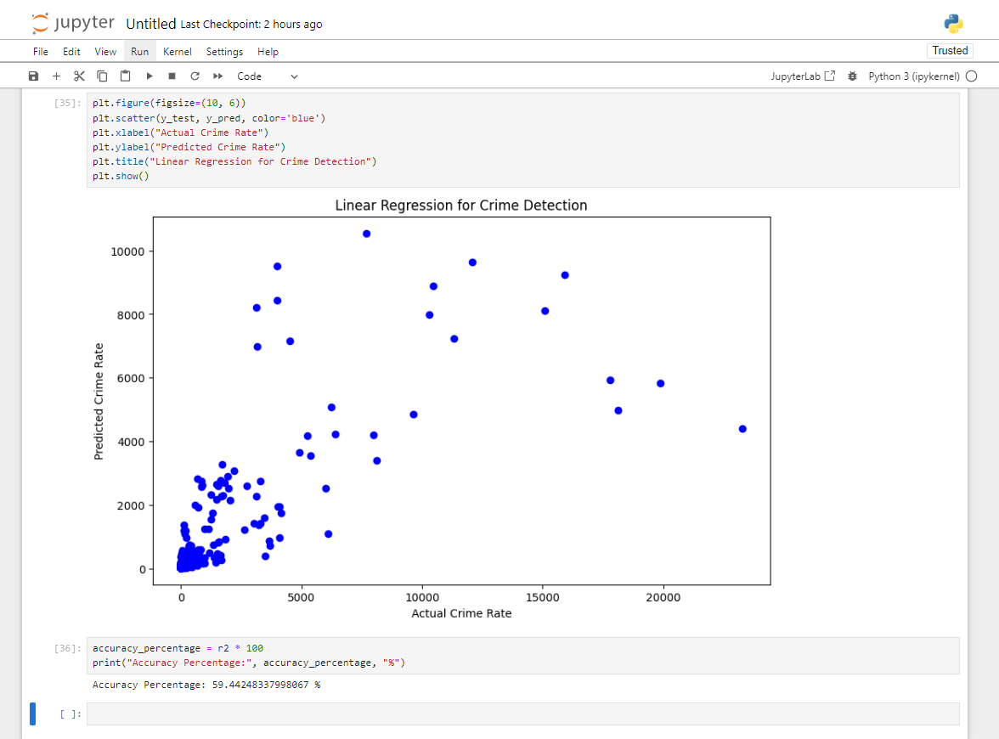

# Project Name

Short description or tagline about what the project does.

## Table of Contents
- [About](#about)
- [Installation](#installation)
- [Usage](#usage)
- [Contributing](#contributing)
- [License](#license)

## About
Detailed description of the project, its purpose, and features. Include any necessary background information or context.

## Installation
Step-by-step guide on how to install, set up, and configure the project. Include any prerequisites or dependencies needed.

## Usage
Instructions and examples on how to use the project. Provide code snippets, screenshots, or demos if applicable.

## Contributing
Guidelines for contributing to the project. Include information on how to report issues, suggest improvements, or submit pull requests.

## License
Information about the project's license. Specify the type of license and include a copy of the license file if applicable.

